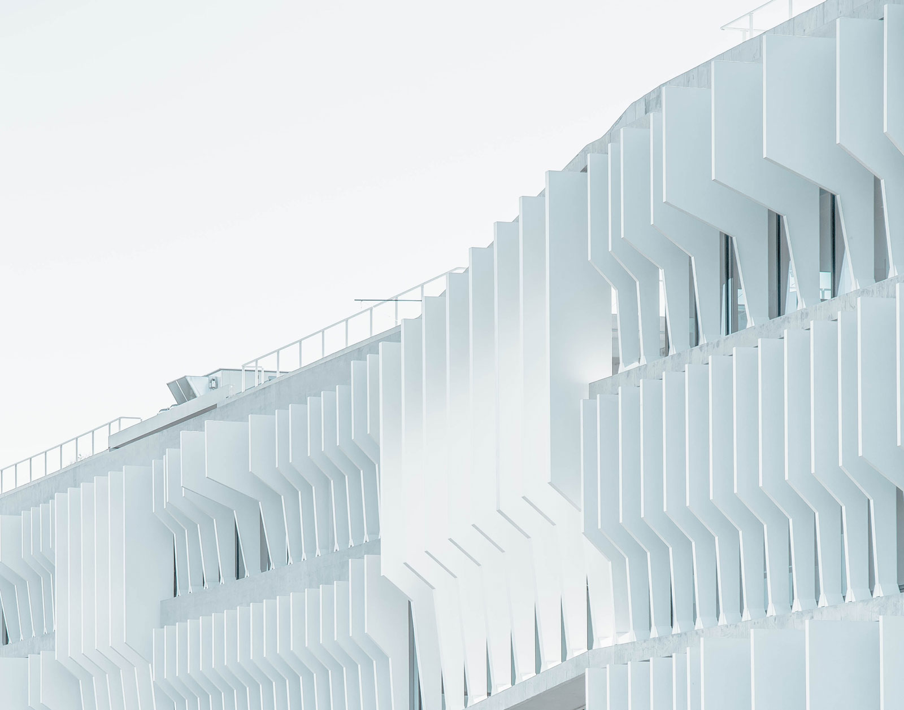

<Column1
	use_modal={true}
	style={{ backgroundColor: "#f6f8f9" }}
>

</Column1>

<Column2 style={{ backgroundColor: "#d8d8da" }}>

<Title style={{ backgroundColor: "#d8d8da" }}>

# [Project 5](/project-5)

### Ut enim veniam

---

<Info li_separator="|">

- **Elit**: nostrud
- **Resse**: 835
- **Anim id**: enim, tempor, sed, dole
- [Voluptate](https://example.com)

</Info>

</Title>

<Description style={{ backgroundColor: "#d8d8da" }}>

Duisaute irure in [minim](https://example.com) et velit esse cillum dolore eu fugiat nulla pariatur. Excepteur sint occaecat cupidatat non proident, sunt in culpa qui officia deserunt mollit anim id est laborum.

*Lorem ipsum dolor sit amet*, consectetur adipiscing elit, sed do eiusmod tempor incididunt ut labore et dolore magna aliqua. Ut enim ad minim veniam, quis nostrud exercitation ullamco laboris nisi ut aliquip ex ea commodo consequat.

- **Excepteur** sint occaecat non
- Eugiat nulla pariatur
- Ut enim ad minim

Ut enim ad minim veniam, quis nostrud exercitation ullamco laboris nisi ut aliquip ex ea commodo consequat. Duisaute irure in et velit esse cillum dolore eu fugiat nulla pariatur. Excepteur sint occaecat cupidatat non proident, sunt in culpa qui officia deserunt mollit anim id est laborum.

</Description>

</Column2>
